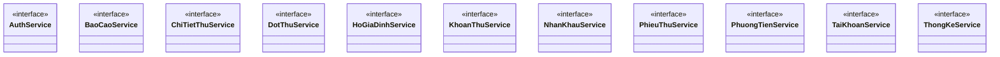

# BIỂU ĐỒ LỚP - HỆ THỐNG QUẢN LÝ CHUNG CƯ BLUEMOON
*(File này được tạo tự động bởi generate_mermaid.py)*

---

## Package: com.bluemoon.models


---

## Package: com.bluemoon.services



---

## Package: com.bluemoon.services.impl

```mermaid
classDiagram

    class AuthServiceImpl {
        -logger : Logger
        -SELECT_BY_USERNAME : String
        -INSERT_ACCOUNT : String
        -UPDATE_PASSWORD : String
        -CHECK_USERNAME_EXISTS : String
    }
    class BaoCaoServiceImpl {
        -logger : Logger
        -phieuThuService : PhieuThuService
        -hoGiaDinhService : HoGiaDinhService
        -nhanKhauService : NhanKhauService
        -dotThuService : DotThuService
    }
    class ChiTietThuServiceImpl {
        -logger : Logger
        -SELECT_BY_MAPHIEU : String
        -INSERT : String
        -DELETE_BY_MAPHIEU : String
    }
    class DotThuServiceImpl {
        -logger : Logger
        -SELECT_ALL : String
        -SELECT_BY_ID : String
        -INSERT : String
        -UPDATE : String
        -DELETE : String
        -CHECK_DEPENDENCIES : String
        -SEARCH : String
    }
    class HoGiaDinhServiceImpl {
        -logger : Logger
        -SELECT_ALL : String
        -SELECT_BY_ID : String
        -INSERT : String
        -UPDATE : String
        -DELETE : String
        -CHECK_SOPHONG_EXISTS : String
        -CHECK_SOPHONG_EXISTS_EXCLUDE_ID : String
    }
    class KhoanThuServiceImpl {
        -logger : Logger
        -SELECT_ALL : String
        -SELECT_BY_ID : String
        -INSERT : String
        -UPDATE : String
        -DELETE : String
        -CHECK_FEE_USED : String
    }
    class NhanKhauServiceImpl {
        -logger : Logger
        -SELECT_ALL : String
        -SELECT_BY_ID : String
        -SELECT_BY_MAHO : String
        -INSERT : String
        -UPDATE : String
        -UPDATE_STATUS : String
        -DELETE : String
    }
    class PhieuThuServiceImpl {
        -logger : Logger
        -dotThuService : DotThuService
        -khoanThuService : KhoanThuService
        -hoGiaDinhService : HoGiaDinhService
        -nhanKhauService : NhanKhauService
        -phuongTienService : PhuongTienService
        -chiTietThuService : ChiTietThuService
        -SELECT_ALL : String
    }
    class PhuongTienServiceImpl {
        -logger : Logger
        -SELECT_ALL : String
        -SELECT_BY_ID : String
        -SELECT_BY_MAHO : String
        -SELECT_BY_BIENSO : String
        -INSERT : String
        -UPDATE : String
        -DELETE : String
    }
    class TaiKhoanServiceImpl {
        -logger : Logger
        -SELECT_ALL : String
        -SELECT_BY_ID : String
        -SELECT_BY_USERNAME : String
        -INSERT : String
        -UPDATE : String
        -UPDATE_PASSWORD : String
        -CHECK_USERNAME_EXISTS : String
    }
    class ThongKeServiceImpl {
        -phieuThuService : PhieuThuService
        -dotThuService : DotThuService
        -hoGiaDinhService : HoGiaDinhService
        -nhanKhauService : NhanKhauService
    }

    AuthService <|.. AuthServiceImpl : implements
    BaoCaoService <|.. BaoCaoServiceImpl : implements
    BaoCaoServiceImpl --> PhieuThuService : uses
    BaoCaoServiceImpl --> HoGiaDinhService : uses
    BaoCaoServiceImpl --> NhanKhauService : uses
    BaoCaoServiceImpl --> DotThuService : uses
    ChiTietThuService <|.. ChiTietThuServiceImpl : implements
    DotThuService <|.. DotThuServiceImpl : implements
    HoGiaDinhService <|.. HoGiaDinhServiceImpl : implements
    KhoanThuService <|.. KhoanThuServiceImpl : implements
    NhanKhauService <|.. NhanKhauServiceImpl : implements
    PhieuThuService <|.. PhieuThuServiceImpl : implements
    PhieuThuServiceImpl --> DotThuService : uses
    PhieuThuServiceImpl --> KhoanThuService : uses
    PhieuThuServiceImpl --> HoGiaDinhService : uses
    PhieuThuServiceImpl --> NhanKhauService : uses
    PhieuThuServiceImpl --> PhuongTienService : uses
    PhieuThuServiceImpl --> ChiTietThuService : uses
    PhuongTienService <|.. PhuongTienServiceImpl : implements
    TaiKhoanService <|.. TaiKhoanServiceImpl : implements
    ThongKeService <|.. ThongKeServiceImpl : implements
    ThongKeServiceImpl --> PhieuThuService : uses
    ThongKeServiceImpl --> DotThuService : uses
    ThongKeServiceImpl --> HoGiaDinhService : uses
    ThongKeServiceImpl --> NhanKhauService : uses```

---

## Package: com.bluemoon.utils

```mermaid
classDiagram

    class AccessManager {
        -logger : Logger
    }
    class DatabaseConnector {
        -logger : Logger
        -DB_URL : String
        -DB_USER : String
        -DB_PASSWORD : String
    }
    class Helper {
    }
    class UserRole <<enumeration>> {
        -code : String
        -displayName : String
    }
    class WebServer {
        -PORT : int
        -objectMapper : ObjectMapper
        -logger : Logger
        -authService : AuthService
        -taiKhoanService : TaiKhoanService
        -khoanThuService : KhoanThuService
        -dotThuService : DotThuService
        -hoGiaDinhService : HoGiaDinhService
    }

    WebServer --> AuthService : uses
    WebServer --> TaiKhoanService : uses
    WebServer --> KhoanThuService : uses
    WebServer --> DotThuService : uses
    WebServer --> HoGiaDinhService : uses
    WebServer --> NhanKhauService : uses
    WebServer --> PhieuThuService : uses
    WebServer --> ThongKeService : uses
    WebServer --> PhuongTienService : uses```

---

