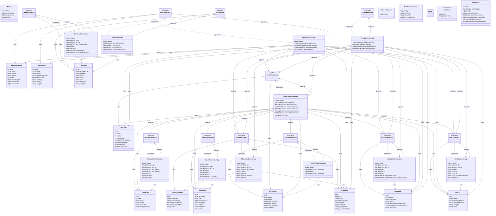

# BIỂU ĐỒ LỚP TỔNG HỢP - HỆ THỐNG QUẢN LÝ CHUNG CƯ BLUEMOON
*(File này được tạo tự động bởi generate_mermaid.py)*

---

```mermaid
classDiagram

    %% Package: com.bluemoon.models
        class BaoCaoCongNo {
            -int maHo
            -int soPhong
            -String chuHo
            -String tenDot
            -int maDot
            -BigDecimal tongTien
            -BigDecimal daThu
            -BigDecimal conNo
        }
        class BaoCaoThu {
            -int maHo
            -int soPhong
            -String chuHo
            -LocalDateTime ngayThu
            -BigDecimal soTien
            -String noiDung
            -String tenDot
            -String trangThai
        }
        class ChiTietThu {
            -int id
            -int maPhieu
            -int maKhoan
            -BigDecimal soLuong
            -BigDecimal donGia
            -BigDecimal thanhTien
            -String tenKhoan
        }
        class DotThu {
            -int id
            -String tenDot
            -LocalDate ngayBatDau
            -LocalDate ngayKetThuc
            -String trangThai
            -String moTa
        }
        class HoGiaDinh {
            -int id
            -int soPhong
            -String maChuHo
            -String ghiChu
            -LocalDateTime thoiGianBatDauO
            -LocalDateTime thoiGianKetThucO
            -String tenChuHo
        }
        class KhoanThu {
            -int id
            -String tenKhoan
            -String loai
            -BigDecimal donGia
            -String donViTinh
            -String tinhTheo
            -boolean batBuoc
            -String moTa
        }
        class LichSuNhanKhau {
            -int id
            -int maNhanKhau
            -String loaiBienDong
            -LocalDate ngayBatDau
            -LocalDate ngayKetThuc
            -int nguoiGhi
        }
        class NhanKhau {
            -int id
            -int maHo
            -String hoTen
            -LocalDate ngaySinh
            -String gioiTinh
            -String soCCCD
            -String ngheNghiep
            -String quanHeVoiChuHo
        }
        class PhieuThu {
            -int id
            -int maHo
            -int maDot
            -int maTaiKhoan
            -LocalDateTime ngayLap
            -BigDecimal tongTien
            -String trangThai
            -String hinhThucThu
        }
        class Phong {
            -int soPhong
            -BigDecimal dienTich
            -BigDecimal giaTien
            -String ghiChu
        }
        class PhuongTien {
            -int id
            -int maHo
            -String loaiXe
            -String bienSo
            -String tenChuXe
            -LocalDate ngayDangKy
        }
        class TaiKhoan {
            -int id
            -String tenDangNhap
            -String matKhau
            -String hoTen
            -String vaiTro
            -String email
            -String dienThoai
            -String trangThai
        }

    %% Package: com.bluemoon.services
        class AuthService <<interface>> {
        }
        class BaoCaoService <<interface>> {
        }
        class ChiTietThuService <<interface>> {
        }
        class DotThuService <<interface>> {
        }
        class HoGiaDinhService <<interface>> {
        }
        class KhoanThuService <<interface>> {
        }
        class NhanKhauService <<interface>> {
        }
        class PhieuThuService <<interface>> {
        }
        class PhuongTienService <<interface>> {
        }
        class TaiKhoanService <<interface>> {
        }
        class ThongKeService <<interface>> {
        }

    %% Package: com.bluemoon.services.impl
        class AuthServiceImpl {
            -Logger logger
            -String SELECT_BY_USERNAME
            -String INSERT_ACCOUNT
            -String UPDATE_PASSWORD
            -String CHECK_USERNAME_EXISTS
        }
        class BaoCaoServiceImpl {
            -Logger logger
            -PhieuThuService phieuThuService
            -HoGiaDinhService hoGiaDinhService
            -NhanKhauService nhanKhauService
            -DotThuService dotThuService
        }
        class ChiTietThuServiceImpl {
            -Logger logger
            -String SELECT_BY_MAPHIEU
            -String INSERT
            -String DELETE_BY_MAPHIEU
        }
        class DotThuServiceImpl {
            -Logger logger
            -String SELECT_ALL
            -String SELECT_BY_ID
            -String INSERT
            -String UPDATE
            -String DELETE
            -String CHECK_DEPENDENCIES
            -String SEARCH
        }
        class HoGiaDinhServiceImpl {
            -Logger logger
            -String SELECT_ALL
            -String SELECT_BY_ID
            -String INSERT
            -String UPDATE
            -String DELETE
            -String CHECK_SOPHONG_EXISTS
            -String CHECK_SOPHONG_EXISTS_EXCLUDE_ID
        }
        class KhoanThuServiceImpl {
            -Logger logger
            -String SELECT_ALL
            -String SELECT_BY_ID
            -String INSERT
            -String UPDATE
            -String DELETE
            -String CHECK_FEE_USED
        }
        class NhanKhauServiceImpl {
            -Logger logger
            -String SELECT_ALL
            -String SELECT_BY_ID
            -String SELECT_BY_MAHO
            -String INSERT
            -String UPDATE
            -String UPDATE_STATUS
            -String DELETE
        }
        class PhieuThuServiceImpl {
            -Logger logger
            -DotThuService dotThuService
            -KhoanThuService khoanThuService
            -HoGiaDinhService hoGiaDinhService
            -NhanKhauService nhanKhauService
            -PhuongTienService phuongTienService
            -ChiTietThuService chiTietThuService
            -String SELECT_ALL
        }
        class PhuongTienServiceImpl {
            -Logger logger
            -String SELECT_ALL
            -String SELECT_BY_ID
            -String SELECT_BY_MAHO
            -String SELECT_BY_BIENSO
            -String INSERT
            -String UPDATE
            -String DELETE
        }
        class TaiKhoanServiceImpl {
            -Logger logger
            -String SELECT_ALL
            -String SELECT_BY_ID
            -String SELECT_BY_USERNAME
            -String INSERT
            -String UPDATE
            -String UPDATE_PASSWORD
            -String CHECK_USERNAME_EXISTS
        }
        class ThongKeServiceImpl {
            -PhieuThuService phieuThuService
            -DotThuService dotThuService
            -HoGiaDinhService hoGiaDinhService
            -NhanKhauService nhanKhauService
        }

    %% Package: com.bluemoon.utils
        class AccessManager {
            -Logger logger
        }
        class DatabaseConnector {
            -Logger logger
            -String DB_URL
            -String DB_USER
            -String DB_PASSWORD
        }
        class Helper {
        }
        class UserRole <<enumeration>> {
            -String code
            -String displayName
        }
        class WebServer {
            -int PORT
            -ObjectMapper objectMapper
            -Logger logger
            -AuthService authService
            -TaiKhoanService taiKhoanService
            -KhoanThuService khoanThuService
            -DotThuService dotThuService
            -HoGiaDinhService hoGiaDinhService
        }

    %% Relationships
    AuthService <|.. AuthServiceImpl : implements
    BaoCaoService <|.. BaoCaoServiceImpl : implements
    ChiTietThuService <|.. ChiTietThuServiceImpl : implements
    DotThuService <|.. DotThuServiceImpl : implements
    HoGiaDinhService <|.. HoGiaDinhServiceImpl : implements
    KhoanThuService <|.. KhoanThuServiceImpl : implements
    NhanKhauService <|.. NhanKhauServiceImpl : implements
    PhieuThuService <|.. PhieuThuServiceImpl : implements
    PhuongTienService <|.. PhuongTienServiceImpl : implements
    TaiKhoanService <|.. TaiKhoanServiceImpl : implements
    ThongKeService <|.. ThongKeServiceImpl : implements
    DotThuService --> DotThu : uses
    PhieuThuServiceImpl --> DotThu : uses
    BaoCaoServiceImpl --> DotThu : uses
    DotThuServiceImpl --> DotThu : uses
    ThongKeServiceImpl --> DotThu : uses
    HoGiaDinhService --> HoGiaDinh : uses
    HoGiaDinhServiceImpl --> HoGiaDinh : uses
    PhieuThuServiceImpl --> HoGiaDinh : uses
    BaoCaoServiceImpl --> HoGiaDinh : uses
    ThongKeServiceImpl --> HoGiaDinh : uses
    PhuongTienService --> PhuongTien : uses
    PhieuThuServiceImpl --> PhuongTien : uses
    PhuongTienServiceImpl --> PhuongTien : uses
    PhieuThuService --> PhieuThu : uses
    PhieuThuServiceImpl --> PhieuThu : uses
    BaoCaoServiceImpl --> PhieuThu : uses
    ThongKeServiceImpl --> PhieuThu : uses
    AuthService --> TaiKhoan : uses
    TaiKhoanService --> TaiKhoan : uses
    TaiKhoanServiceImpl --> TaiKhoan : uses
    AuthServiceImpl --> TaiKhoan : uses
    KhoanThuService --> KhoanThu : uses
    PhieuThuServiceImpl --> KhoanThu : uses
    KhoanThuServiceImpl --> KhoanThu : uses
    NhanKhauService --> LichSuNhanKhau : uses
    NhanKhauServiceImpl --> LichSuNhanKhau : uses
    NhanKhauService --> NhanKhau : uses
    PhieuThuServiceImpl --> NhanKhau : uses
    NhanKhauServiceImpl --> NhanKhau : uses
    BaoCaoServiceImpl --> NhanKhau : uses
    ThongKeServiceImpl --> NhanKhau : uses
    ChiTietThuService --> ChiTietThu : uses
    PhieuThuService --> ChiTietThu : uses
    PhieuThuServiceImpl --> ChiTietThu : uses
    ChiTietThuServiceImpl --> ChiTietThu : uses
    BaoCaoService --> BaoCaoThu : uses
    BaoCaoServiceImpl --> BaoCaoThu : uses
    BaoCaoService --> BaoCaoCongNo : uses
    BaoCaoServiceImpl --> BaoCaoCongNo : uses
    HoGiaDinhServiceImpl --> HoGiaDinhService : depends
    PhieuThuServiceImpl --> DotThuService : depends
    PhieuThuServiceImpl --> ChiTietThuService : depends
    PhieuThuServiceImpl --> HoGiaDinhService : depends
    PhieuThuServiceImpl --> KhoanThuService : depends
    PhieuThuServiceImpl --> PhieuThuService : depends
    PhieuThuServiceImpl --> PhuongTienService : depends
    PhieuThuServiceImpl --> NhanKhauService : depends
    PhuongTienServiceImpl --> PhuongTienService : depends
    NhanKhauServiceImpl --> NhanKhauService : depends
    BaoCaoServiceImpl --> DotThuService : depends
    BaoCaoServiceImpl --> HoGiaDinhService : depends
    BaoCaoServiceImpl --> PhieuThuService : depends
    BaoCaoServiceImpl --> BaoCaoService : depends
    BaoCaoServiceImpl --> NhanKhauService : depends
    ChiTietThuServiceImpl --> ChiTietThuService : depends
    DotThuServiceImpl --> DotThuService : depends
    TaiKhoanServiceImpl --> TaiKhoanService : depends
    ThongKeServiceImpl --> DotThuService : depends
    ThongKeServiceImpl --> ThongKeService : depends
    ThongKeServiceImpl --> HoGiaDinhService : depends
    ThongKeServiceImpl --> PhieuThuService : depends
    ThongKeServiceImpl --> NhanKhauService : depends
    ThongKeServiceImpl --> HoGiaDinhServiceImpl : depends
    ThongKeServiceImpl --> PhieuThuServiceImpl : depends
    ThongKeServiceImpl --> NhanKhauServiceImpl : depends
    ThongKeServiceImpl --> DotThuServiceImpl : depends
    KhoanThuServiceImpl --> KhoanThuService : depends
    AuthServiceImpl --> AuthService : depends
```
