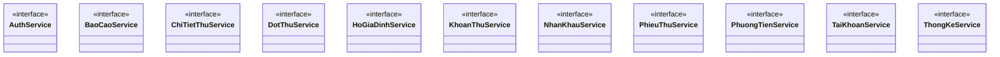

# BIỂU ĐỒ LỚP - HỆ THỐNG QUẢN LÝ CHUNG CƯ BLUEMOON
*(File này được tạo tự động bởi generate_mermaid.py)*

---

## Package: com.bluemoon.models

```mermaid
classDiagram

    class BaoCaoCongNo {
        -int maHo
        -int soPhong
        -String chuHo
        -String tenDot
        -int maDot
        -BigDecimal tongTien
        -BigDecimal daThu
        -BigDecimal conNo
    }
    class BaoCaoThu {
        -int maHo
        -int soPhong
        -String chuHo
        -LocalDateTime ngayThu
        -BigDecimal soTien
        -String noiDung
        -String tenDot
        -String trangThai
    }
    class ChiTietThu {
        -int id
        -int maPhieu
        -int maKhoan
        -BigDecimal soLuong
        -BigDecimal donGia
        -BigDecimal thanhTien
        -String tenKhoan
    }
    class DotThu {
        -int id
        -String tenDot
        -LocalDate ngayBatDau
        -LocalDate ngayKetThuc
        -String trangThai
        -String moTa
    }
    class HoGiaDinh {
        -int id
        -int soPhong
        -String maChuHo
        -String ghiChu
        -LocalDateTime thoiGianBatDauO
        -LocalDateTime thoiGianKetThucO
        -String tenChuHo
    }
    class KhoanThu {
        -int id
        -String tenKhoan
        -String loai
        -BigDecimal donGia
        -String donViTinh
        -String tinhTheo
        -boolean batBuoc
        -String moTa
    }
    class LichSuNhanKhau {
        -int id
        -int maNhanKhau
        -String loaiBienDong
        -LocalDate ngayBatDau
        -LocalDate ngayKetThuc
        -int nguoiGhi
    }
    class NhanKhau {
        -int id
        -int maHo
        -String hoTen
        -LocalDate ngaySinh
        -String gioiTinh
        -String soCCCD
        -String ngheNghiep
        -String quanHeVoiChuHo
    }
    class PhieuThu {
        -int id
        -int maHo
        -int maDot
        -int maTaiKhoan
        -LocalDateTime ngayLap
        -BigDecimal tongTien
        -String trangThai
        -String hinhThucThu
    }
    class Phong {
        -int soPhong
        -BigDecimal dienTich
        -BigDecimal giaTien
        -String ghiChu
    }
    class PhuongTien {
        -int id
        -int maHo
        -String loaiXe
        -String bienSo
        -String tenChuXe
        -LocalDate ngayDangKy
    }
    class TaiKhoan {
        -int id
        -String tenDangNhap
        -String matKhau
        -String hoTen
        -String vaiTro
        -String email
        -String dienThoai
        -String trangThai
    }
```



---

## Package: com.bluemoon.services



---

## Package: com.bluemoon.services.impl

```mermaid
classDiagram

    class AuthServiceImpl {
        -Logger logger
        -String SELECT_BY_USERNAME
        -String INSERT_ACCOUNT
        -String UPDATE_PASSWORD
        -String CHECK_USERNAME_EXISTS
    }
    class BaoCaoServiceImpl {
        -Logger logger
        -PhieuThuService phieuThuService
        -HoGiaDinhService hoGiaDinhService
        -NhanKhauService nhanKhauService
        -DotThuService dotThuService
    }
    class ChiTietThuServiceImpl {
        -Logger logger
        -String SELECT_BY_MAPHIEU
        -String INSERT
        -String DELETE_BY_MAPHIEU
    }
    class DotThuServiceImpl {
        -Logger logger
        -String SELECT_ALL
        -String SELECT_BY_ID
        -String INSERT
        -String UPDATE
        -String DELETE
        -String CHECK_DEPENDENCIES
        -String SEARCH
    }
    class HoGiaDinhServiceImpl {
        -Logger logger
        -String SELECT_ALL
        -String SELECT_BY_ID
        -String INSERT
        -String UPDATE
        -String DELETE
        -String CHECK_SOPHONG_EXISTS
        -String CHECK_SOPHONG_EXISTS_EXCLUDE_ID
    }
    class KhoanThuServiceImpl {
        -Logger logger
        -String SELECT_ALL
        -String SELECT_BY_ID
        -String INSERT
        -String UPDATE
        -String DELETE
        -String CHECK_FEE_USED
    }
    class NhanKhauServiceImpl {
        -Logger logger
        -String SELECT_ALL
        -String SELECT_BY_ID
        -String SELECT_BY_MAHO
        -String INSERT
        -String UPDATE
        -String UPDATE_STATUS
        -String DELETE
    }
    class PhieuThuServiceImpl {
        -Logger logger
        -DotThuService dotThuService
        -KhoanThuService khoanThuService
        -HoGiaDinhService hoGiaDinhService
        -NhanKhauService nhanKhauService
        -PhuongTienService phuongTienService
        -ChiTietThuService chiTietThuService
        -String SELECT_ALL
    }
    class PhuongTienServiceImpl {
        -Logger logger
        -String SELECT_ALL
        -String SELECT_BY_ID
        -String SELECT_BY_MAHO
        -String SELECT_BY_BIENSO
        -String INSERT
        -String UPDATE
        -String DELETE
    }
    class TaiKhoanServiceImpl {
        -Logger logger
        -String SELECT_ALL
        -String SELECT_BY_ID
        -String SELECT_BY_USERNAME
        -String INSERT
        -String UPDATE
        -String UPDATE_PASSWORD
        -String CHECK_USERNAME_EXISTS
    }
    class ThongKeServiceImpl {
        -PhieuThuService phieuThuService
        -DotThuService dotThuService
        -HoGiaDinhService hoGiaDinhService
        -NhanKhauService nhanKhauService
    }

    AuthService <|.. AuthServiceImpl : implements
    BaoCaoService <|.. BaoCaoServiceImpl : implements
    BaoCaoServiceImpl --> PhieuThuService : uses
    BaoCaoServiceImpl --> HoGiaDinhService : uses
    BaoCaoServiceImpl --> NhanKhauService : uses
    BaoCaoServiceImpl --> DotThuService : uses
    ChiTietThuService <|.. ChiTietThuServiceImpl : implements
    DotThuService <|.. DotThuServiceImpl : implements
    HoGiaDinhService <|.. HoGiaDinhServiceImpl : implements
    KhoanThuService <|.. KhoanThuServiceImpl : implements
    NhanKhauService <|.. NhanKhauServiceImpl : implements
    PhieuThuService <|.. PhieuThuServiceImpl : implements
    PhieuThuServiceImpl --> DotThuService : uses
    PhieuThuServiceImpl --> KhoanThuService : uses
    PhieuThuServiceImpl --> HoGiaDinhService : uses
    PhieuThuServiceImpl --> NhanKhauService : uses
    PhieuThuServiceImpl --> PhuongTienService : uses
    PhieuThuServiceImpl --> ChiTietThuService : uses
    PhuongTienService <|.. PhuongTienServiceImpl : implements
    TaiKhoanService <|.. TaiKhoanServiceImpl : implements
    ThongKeService <|.. ThongKeServiceImpl : implements
    ThongKeServiceImpl --> PhieuThuService : uses
    ThongKeServiceImpl --> DotThuService : uses
    ThongKeServiceImpl --> HoGiaDinhService : uses
    ThongKeServiceImpl --> NhanKhauService : uses```

---

## Package: com.bluemoon.utils

```mermaid
classDiagram

    class AccessManager {
        -Logger logger
    }
    class DatabaseConnector {
        -Logger logger
        -String DB_URL
        -String DB_USER
        -String DB_PASSWORD
    }
    class Helper {
    }
    class UserRole <<enumeration>> {
        -String code
        -String displayName
    }
    class WebServer {
        -int PORT
        -ObjectMapper objectMapper
        -Logger logger
        -AuthService authService
        -TaiKhoanService taiKhoanService
        -KhoanThuService khoanThuService
        -DotThuService dotThuService
        -HoGiaDinhService hoGiaDinhService
    }

    WebServer --> AuthService : uses
    WebServer --> TaiKhoanService : uses
    WebServer --> KhoanThuService : uses
    WebServer --> DotThuService : uses
    WebServer --> HoGiaDinhService : uses
    WebServer --> NhanKhauService : uses
    WebServer --> PhieuThuService : uses
    WebServer --> ThongKeService : uses
    WebServer --> PhuongTienService : uses```

---

